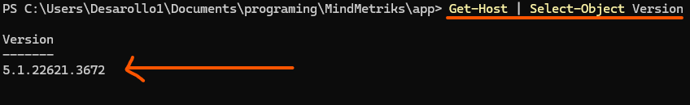
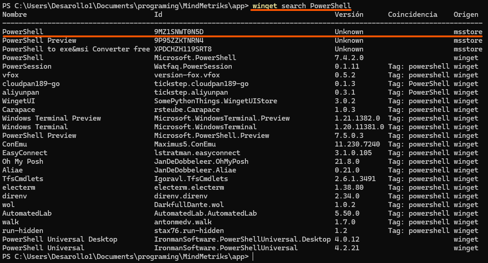
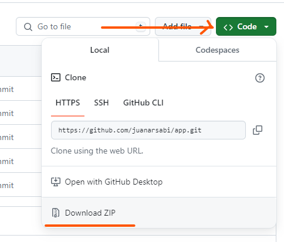
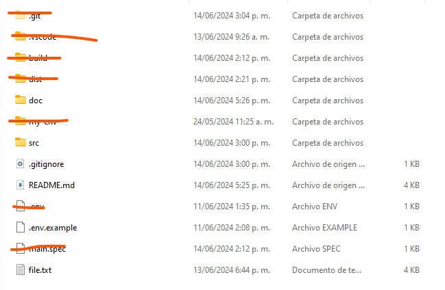
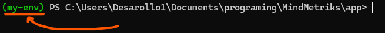
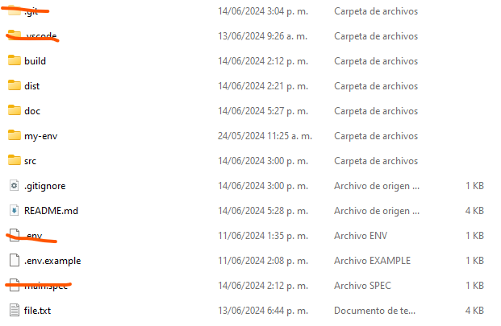
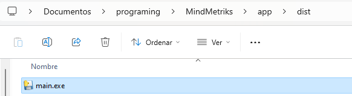

# Transcripción masiva

## Tecologías utilizadas

**Python:** 3.12

**Whisper:** Última versión disponible

**Git:** Cualquier versión de Git

## Instalación

### 1. Descargar programas necesarios

Descargar Python en su versión 3.12

- [Microsoft Store](https://www.microsoft.com/store/productId/9NCVDN91XZQP?ocid=pdpshare)

Descargar Git

- [Git](https://www.git-scm.com/downloads)

### 2. Validar version de programas instalados/instalar programas

> ❗Se necesita tener instalados algunos programas, puede que quiza ya esten instalados por defecto

#### 2.1 Verificar la version de PowerShell

```bash
  Get-Host | Select-Object Version
```



> 💡Si la version de PowerShell es menor que **5.1.x** tienes que seguir estos pasos para instalar una versión mas reciente, si no, haz caso omiso a los siguientes pasos

#### 2.2 Verificar versiones recientes

```bash
  winget search PowerShell
```



> 💡Anota el id que te sale en PowerShell

#### 2.3 Instalar una versión reciente de PowerShell

```bash
  winget install {AppId - id del paso anterior}
```

Ejemplo:

```bash
  winget install 9MZ1SNWT0N5D
```

Una vez terminada la instalación cierra PowerShell, vuelvelo a abrir y vuelve a ejecutar el comando para verificar que versión se tiene instalada

```bash
  winget search PowerShell
```

### 3. Instalar sistema de gestion de paquetes

Instalar [Scoop](https://scoop.sh/)

```bash
  Set-ExecutionPolicy  -ExecutionPolicy RemoteSigned -Scope CurrentUser
  Invoke-RestMethod -Uri https://get.scoop.sh | Invoke-Expression
```

Instalar ffmpeg (instalardo una vez este instalado scoop)

```bash
  scoop install ffmpeg
```

## Descargar código fuente

> 💡Para ejecutarlo tienes que tener el código fuente, con lo cúal puedes hacerlo de dos maneras

### 1. Descargar la carpeta comprimida y remplaza los archivos

Dale clic en code y descarga el codigo en una carpeta comprimida



### 2. Clonar el repositorio (requiere conocimiento)

Clonar el repositorio

```bash
  git clone https://github.com/juanarsabi/app.git
```

Al finalizar deberas tener algo como lo siguiente:



## Descargar dependencias de Python

- Crear ambiente virtual (es para lo que se necesita para la ejecucion solo se use en esa carpeta y no en otras carpetas)

```bash
  python -m venv my-env
```

- Activar el ambiente virtual

```bash
  my-env\Scripts\activate
```

> 💡Para verificar que el ambiente este arriba tienes que darle verificar que en la consola (CMD / PowerShell), te salga venv al inicio



- Instalar pyinstaller

```bash
  pip install pyinstaller
```

- Instalar pandas

```bash
  pip install pandas
```

- Instalar librosa

```bash
  pip install librosa
```

- Instalar Pydub

```bash
  pip install pydub
```

- Instalar tkinder

```bash
  pip install tk
```

- Instalar moviepy

```bash
  pip install moviepy
```

- Instalar zipfile

```bash
  pip install zipfile36
```

## Crear aplicación

Debes crear la aplicación para poder ejecutarla, ya que en los pasos anteriores solo descargamos dependencias pero no hemos creado la aplicación aún

> Este paso se tendra que hacer cada vez que hayan cambios en el código, un cambio puede ser una nueva version de la aplicación 🆕 o correción de errores 💔, si no sucede ningun escenario no se debe repetir este paso

```bash
  pyinstaller --onefile -w src/main.py
```



Esto te generara la aplicacion en la carpeta dist



## Ejecutar localmente

Ejecutar el programa buscando el archivo

```bash
  app/dist/main.exe
```
